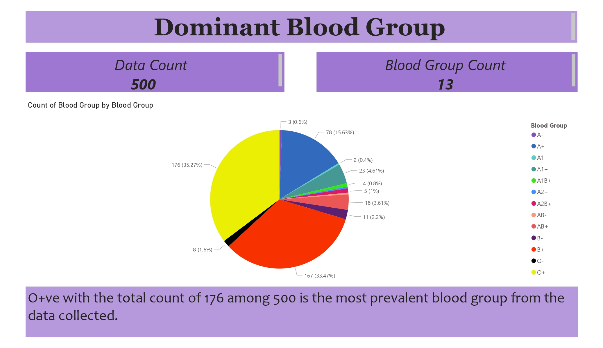
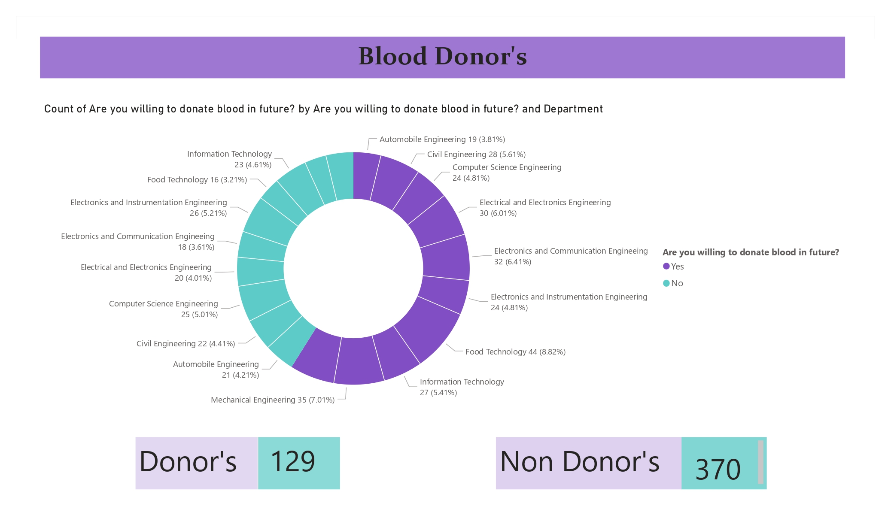
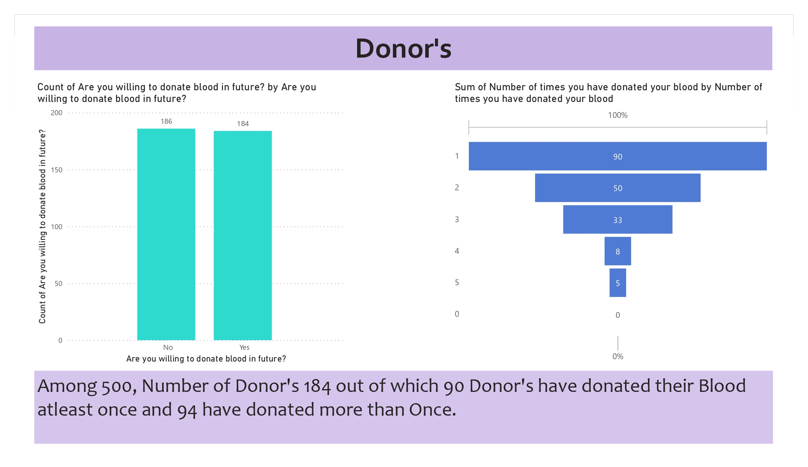
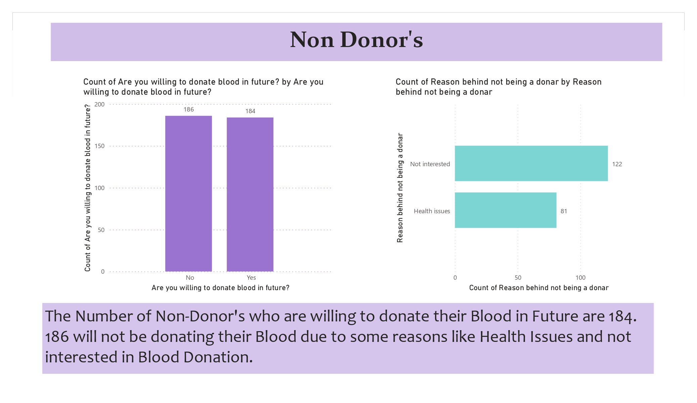

# DataAnalysis
 An analysis done to find the insights about Blood Donor's.
# BloodData_Analysis

The real time dataset is collected, processed and analyzed to gather the insights on blood group, blood donors and many more using powerBI.

# INFERENCE #1

 On the total count of 500 samples collected within the institution the most dominant blood group found was O+ve and the lest dominant blood groun is AB-ve.

   
# INFERENCE #2
 
Of those 500 samples 129 students are blood donors and 370 are non donars due to their unwillingness and health issues

# INFERENCE #3
   
Among 129 donor's  90 have donated their blood atleast once and the rest have donated their v=blood more than once.

   
  
   
   
   
   
# INFERENCE #4

The number of non donors who are willing to donate their blood in future is 184, who will be happily donate their blood in nearby needs.

  
